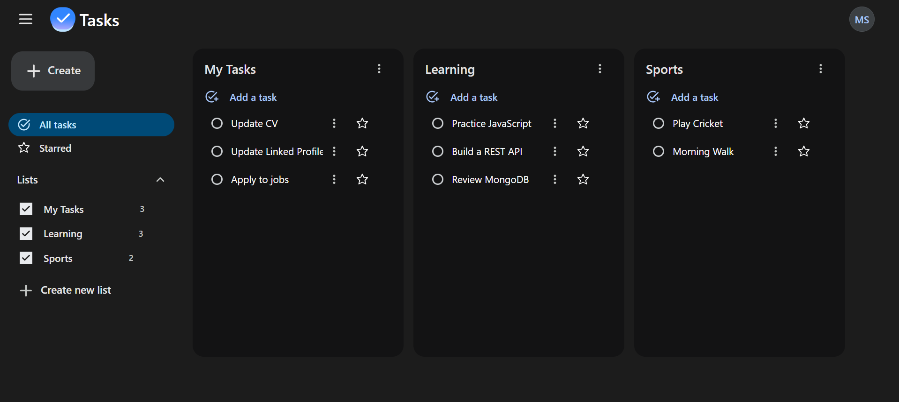

# Web Tasks

A task management app with multiple lists, built with React. Sign up, create lists, add tasks, star the important ones and move tasks between lists.

**Live demo:** https://tasks-webapp.netlify.app



## Features

- Sign up and sign in with JWT authentication
- Create multiple lists and show or hide each one
- Add, edit, complete and delete tasks
- Star tasks and view all starred tasks in one place
- Move tasks between lists
- Dark interface styled with Tailwind CSS

## Tech Stack

| Area | Technologies |
| --- | --- |
| UI | React 19, Tailwind CSS 4 |
| State management | Redux Toolkit |
| Forms | React Hook Form |
| Build tool | Vite |
| Backend | Node.js, Express, MongoDB ([web-tasks-backend](https://github.com/MuhammadSabir329/web-tasks-backend)) |
| Deployment | Netlify |

## Getting Started

**Requirements:** Node.js 20.19 or later.

```bash
git clone https://github.com/MuhammadSabir329/web-tasks-frontend.git
cd web-tasks-frontend
npm install
npm run dev
```

The app runs at the address shown in your terminal (usually `http://localhost:5173`).

### Connecting to the API

The app talks to the backend API. To run it against your own backend, run the [backend](https://github.com/MuhammadSabir329/web-tasks-backend) locally and change the `API_URL` constant (in `src/App.jsx`, `src/store/authSlice.js` and `src/store/listsSlice.js`) to `http://localhost:5000`.

## Scripts

| Command | What it does |
| --- | --- |
| `npm run dev` | Start the development server |
| `npm run build` | Create a production build |
| `npm run preview` | Preview the production build |
| `npm run lint` | Run ESLint |

## Project Structure

```
src/
  components/    Reusable UI (lists, tasks, header, menus)
  store/         Redux Toolkit store (auth and lists slices)
  App.jsx        Main layout and routing between views
  SignIn.jsx, SignUp.jsx
```

## Author

**Muhammad Sabir**, Junior Full-Stack Developer (MERN)

- GitHub: [MuhammadSabir329](https://github.com/MuhammadSabir329)
- LinkedIn: [Muhammad Sabir](https://www.linkedin.com/in/muhammad-sabir-226b7443b/)
- Email: msabir.work@gmail.com
